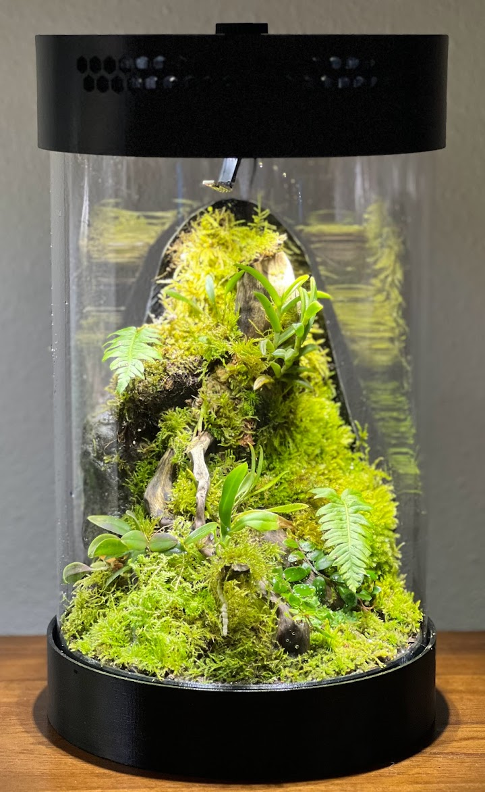

   

# Oasis

https://oasis-terrarium.com

Oasis is a fully open-source, mostly 3d-printed smart terrarium. It provides the ideal environment for humidity-loving plants like mosses, ferns, orchids, and many others. The design includes:

- [high power LED lighting](/docs/random_notes/#light-intensity)
- a mister for providing plants with water and maintaining high humidity
- fans for airflow
- a temperature/humidity sensor for monitoring environment conditions
- wifi connectivity to allow control and configuration from your phone or computer (see [web interface](/docs/usage_guide/#web-interface))

See the website for pictures, build details and more: https://oasis-terrarium.com.

This repository contains full sources for the CAD models (designed with [CadQuery](https://github.com/cadquery/cadquery)), electronics (designed in [KiCad](https://www.kicad.org/)), and software (written in rust using the [esp-rs](https://github.com/esp-rs) libraries).

Most of this project is accessible to the average DIYer with access to a 3d printer, however the electronics portion of the project is a bit more involved. Fully-assembled electronics can be ordered from companies like JLCPCB by uploading the files from this repo, but this can be expensive for small order quantities. Those with the right equipment and experience soldering small parts could order the bare PCBs and components separately, then do their own assembly and soldering.

I'd like to eventually offer the assembled electronics as a kit, but don't have immediate plans for doing so. To express interest in a kit and to subscribe for future updates, please fill out this form: https://forms.gle/WesLJEf8hVrUT4jXA.
