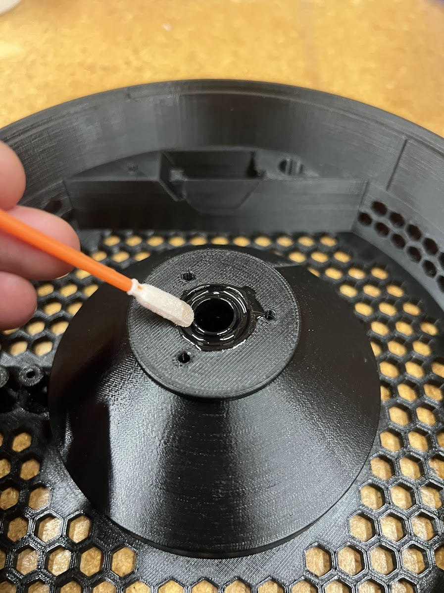
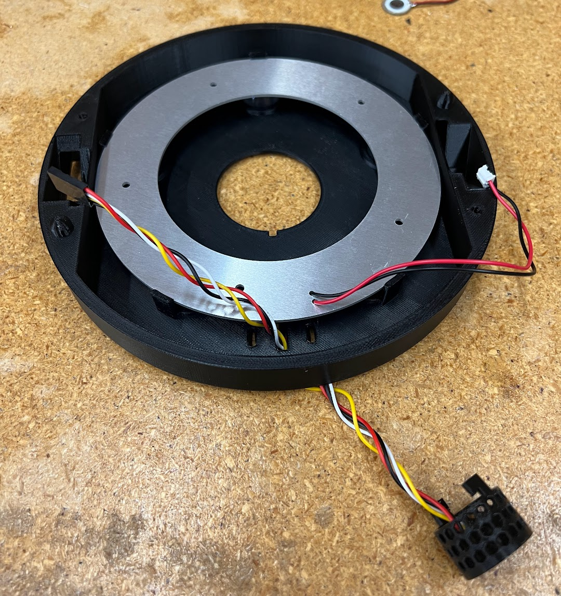
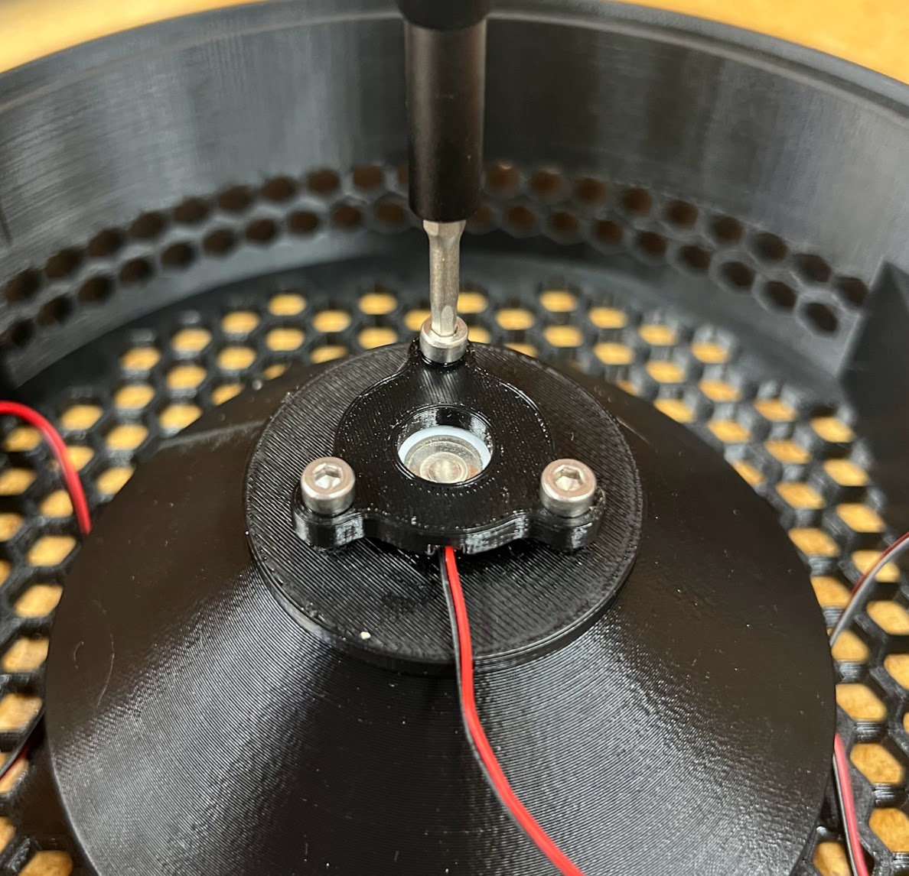

+++
title = 'Build Guide'
weight = 2
+++

# Oasis Build Guide

Below is a step-by-step guide on building the terrarium.

## Bill of Materials

| Item                                    | Quantity       | Source 1                                                           | Source 2                                                                                                     | Notes                                                                                                                           |
| --------------------------------------- | -------------- | ------------------------------------------------------------------ | ------------------------------------------------------------------------------------------------------------ | ------------------------------------------------------------------------------------------------------------------------------- |
| Carclo 10140 LED Optics                 | 5              | [amazon](https://www.amazon.com/dp/B00LWU1G78) ($8.50 for 6)       | [LEDsupply](https://www.ledsupply.com/led-optics/10140-carclo-lens-frosted-wide-spot-led-optic) ($1.60 each) | Other carclo 20mm optics will work. Different options include frosted/not-frosted and different illumination patterns / angles. |
| O rings (18mm OD 12mm ID 3mm Width)     | 2              | [amazon](https://www.amazon.com/dp/B08HHDG9SX) ($9 for 20)         |                                                                                                              |                                                                                                                                 |
| Acrylic Sheet - 12" x 24" x 1/32" thick | 1              | [amazon](https://www.amazon.com/dp/B08SW564X3?=) ($10)             |                                                                                                              |                                                                                                                                 |
| Acrylic Cement                          | just a bit     | [amazon](https://www.amazon.com/dp/B00R5NYM7M) ($18 for 5oz tube)  |                                                                                                              |                                                                                                                                 |
| 24v blower fan 30x30x10mm               | 2              | [amazon](https://www.amazon.com/dp/B08MKLDGQR) ($10 for 2)         | [amazon](https://www.amazon.com/dp/B0CGTRNFZV) ($12 for 6)                                                   |                                                                                                                                 |
| Temperature/Humidity Sensor Board       | 1              | [amazon](https://www.amazon.com/dp/B0CN32WXJY) ($13 for 3)         |                                                                                                              | This board needs a cable soldered to it. See the [Electronics Page](/docs/electronics/#sht30-sensor-board-wiring) for details.  |
| 18V 1A+ Power Supply                    | 1              | [amazon](https://www.amazon.com/dp/B0C7158MH4) ($10)               | [digikey](https://www.digikey.com/en/products/detail/globtek-inc/WR9HH1000LCP-F-R6B/10187589) ($5.87)        |                                                                                                                                 |
| Ultrasonic Mister Disc                  | 1              | [amazon](https://www.amazon.com/dp/B0C1C79BH3) ($9 for 3)          |                                                                                                              | These come with their own circuit boards, which aren't needed because the driver circuit is built into the oasis mainboard.     |
| Epoxy Resin                             | about 80 grams | [amazon](https://www.amazon.com/dp/B07YCVVYFK) ($21 for 960g/34oz) |                                                                                                              |                                                                                                                                 |
| Grease                                  | just a bit     | [amazon](https://www.amazon.com/dp/B004X70LZA) ($6 for 8oz)        |                                                                                                              |                                                                                                                                 |
| M3x20mm Socket Cap Screws               | 2              |                                                                    |                                                                                                              |                                                                                                                                 |
| M3x8mm Socket Cap Screws                | 4              |                                                                    |                                                                                                              |                                                                                                                                 |

### 3D-Printed Parts

| Name          |
| ------------- |
| Top           |
| Bottom        |
| Underplate    |
| Mister Cover  |
| Top Plug      |
| Sensor Basket |

See https://www.printables.com/model/1315117-oasis-smart-terrarium.

### Custom Electronics

This project requires two custom electronics boards: a mainboard and an LED board. See the [Electronics page](/docs/electronics) for more info.

## 3D Printing

This project requires a number of 3d-printed parts. Most of them need to handle high humidity and/or direct contact with water, so it's important to use a material that can handle that. PLA, for example, is a poor choice. I used PETG for this, but ABS and some other plastics should work well.

Model files (STL/STEP) can be downloaded from [printables.com](https://www.printables.com/model/1315117-oasis-smart-terrarium) or [GitHub](https://github.com/justbuchanan/oasis/releases/tag/v1).

### Supports

The only 3d-printed part that needs supports during printing is the sensor basket, which has two small tabs at the top. Tree supports in PrusaSlicer worked well here. All other parts for this project are designed to not need supports.

### PETG Settings

I used a Prusa i3 MK3S+ to print parts in PETG for this project. I initially had some trouble with my first layer of printing, so I've included the settings changes to PrusaSlicer I used below. These print settings are not specific to this project, but may be helpful. My main issue was lack of bed adhesion, so I slowed down the first layer significantly.

- Layers and Perimeters > Quality > Extra perimeters if needed: no -> yes
- Infill density: 15% -> 25%
- Speed > Modifiers > First layer speed: 20mm/s -> 10mm/s
- Speed > Acceleration Control > First layer: 800mm/s^2 -> 600mm/s^2
- Filaments > Temperature > Bed > First Layer: 85C -> 90C

### Waterproofing

There are two printed parts that need to be able to hold water without leaking. While it's _possible_ to get these waterproof straight off of the printer by tweaking your print settings, this is difficult and unlikely to work consistently. I used a low-viscosity epoxy to waterproof the bottom piece as well as the water tank in the top piece.

> [!NOTE]+ Note
> I initially tried to use polyurethane for waterproofing, but found that after two coats, the water tank still leaked. I was eventually able to achieve waterproofing after four coats. Epoxy has consistently worked after just one application.

#### Waterproofing Step-By-Step Guide

Before you begin, you will need the following:

- epoxy
- 3d-printed top piece
- 3d-printed bottom piece
- 3d-printed top plug
- o-ring
- paper towels
- optional: solo cup(s), small funnel, gloves, q-tips, weigh scale

Detailed instructions (with pictures!) follow, but the **tl;dr is: fill the water tank in the top piece with epoxy and slosh it around to fully coat the interior. Drain the excess epoxy into the bottom piece and slosh that around to fully coat its interior. After curing, the pieces will be waterproof.**

Start by mixing up about 80 grams of epoxy (40g part A, 40g part B). This is by no means an exact amount you need to match, but should give you an idea of how much is needed. Follow the instructions that come with your epoxy and be sure to mix well.

Place the o-ring and then the top plug into the top piece.

Place the top piece on a table upside-down, then pour the epoxy into the water tank.

Once the water tank is filled, remove the funnel and cover the hole with a piece of tape or your thumb. Now you'll need to slowly rotate the top piece around to ensure that the epoxy flows around inside the water tank and covers all interior surfaces. Take your time with this and make sure to tilt the piece at every possible angle. It's much better to spend a few extra minutes here making the sure the epoxy covers everything than to later find out that the water tank isn't waterproof. This process should take several minutes.

Once you've thoroughly coated the interior of the water tank, set the top piece on top of the bottom piece and allow all the excess epoxy to drain out.

Remove the plug and o-ring from the top and wipe them clean of epoxy using a paper towel.

It should take about 5-10 minutes for most of the epoxy to drain from the top piece into the bottom piece. Once that's done, smear a tiny amount of epoxy in the o-ring well of the top piece. Use just enough to coat the surface, but not enough that the o-ring will not fit later. Use a paper towel to wipe up the surface and clean up any excess.

Set the top piece somewhere (with epoxy entry/exit hole facing down) to continue draining any remaining excess epoxy and to cure. It's worth checking on this an hour or two later and wiping down any epoxy drips that may have formed.

Next step is to coat the interior of the bottom piece with epoxy. Slowly tilt and rotate the piece so that the epoxy covers and coats the entire bottom surface and inside walls. Try your best not to let the epoxy flow into the circular slot that the terrarium walls will later fit into. If this happens, just be sure to clean it out with a paper towel before it cures.

That's about it for waterproofing! Set the bottom piece on a level surface to cure. As mentioned above, you should come back in an hour or two to wipe any excess epoxy drips from the top piece that may have formed. Epoxy typically takes 24 hours to cure, but you should follow the instructions for your specific epoxy.

## Glue Acrylic Sheet to Create The Walls

TODO

## Assembly

Once you've got all the required materials, it's time to put it together!

(note: fans are missing in the above photo)

Before starting the build, it may be helpful to take a look at the [Interactive 3D Model](/docs/3dmodel) to visually see how everything comes together.

### LED Optics

Insert the five LED optics into their slots in the 3d-printed "underplate". Each optic has a small rectangular tab that sticks out on one side. Make sure this aligns with the corresponding slot on the 3d print.

### Insert the LED board

Align the led board so that the LEDs face down and the power cable points roughly in the direction of the three slots cut out on the underplate. Align the LEDs with their optics and press the board into place. Next to each optic is a 3d-printed clip that will latch onto the led board.

### Insert the temperature/humidity sensor

The sht30 temperature/humidity sensor board fits into a rectangular slot in the sensor basket.

> [!WARNING]+ Warning
> The tabs on the top of the sensor basket are very fragile.

### Attach sensor basket to underplate

Start by threading the sensor cable through the slot in the underplate.

Next, attach the sensor basket to the underplate by inserting the tabs on the basket through the slots on the underplate. Rotate the sensor basket to engage the tabs.

### Insert the Mainboard

Use an M3x8mm screw to attach the mainboard to the 3d-printed top.

### Insert the Fans

The top contains a slot on each side that the fans slide into. The cable should point towards the center of the top and pass through the small cutout in the print.

### Connect the Fans

Connect the fan power cables to the labeled connectors on the mainboard. Note that fan1 and fan2 are interchangeable - it doesn't matter which fan plugs into which connector.

### Assemble the Mister

> [!WARNING]+ Warning
> The connection point between the wires and the disc is very fragile and prone to breaking apart. Be careful when handling the unit and don't bend the wires excessively.

Start by spreading a small amount of grease on an o-ring, then place it on the o-ring "well" on the water tank.

Place the misting disc on top of the o-ring on top of the o-ring, pointing the wire in the direction of the mainboard.

Use three M3x8mm screws to attach the mister cover, taking care to align the slot over the mister cable. Tighten the screws just enough that there's some pressure on the mister, but not more. You may need to come back later to adjust these tighter if water is able to leak around the o-ring or looser if the misting disc is too constrained to produce mist. See the [mister adjustment notes](/docs/usage_guide/#adjusting-the-mister) if needed.

### Plug in Misting Disc

Plug the mister into the labeled connector on the mainboard.

> [!WARNING]+ Warning
> The mister and the lights use the same connector - be careful to plug the mister into the correct one. If you plug it into the wrong connector, use a pair of needle-nose pliers to gently take it out - don't pull it out by the cable.

### Mount the Underplate

Align the top and underplate as shown in the picture below, then connect the LED board power cable and sensor cable to the mainboard.

Flip the underplate over onto the top piece and align the "registration posts" on the underplate with the corresponding slots in the top piece. Take care not pinch any wires and to route the misting disc cable through the slot in the underplate. Use two M3x20mm screws to hold the parts together.

### Top Plug

Insert an o-ring into the water tank inlet at the top. Grease is optional, but recommended here.

Insert the top plug into the inlet and turn to tighten.

### Final Assembly

Almost done! Insert the acrylic terrarium walls into the the bottom piece, then add the top piece.

## Assembly Complete! What's Next?

Please see the [Usage Guide](/docs/usage_guide) for next steps.
