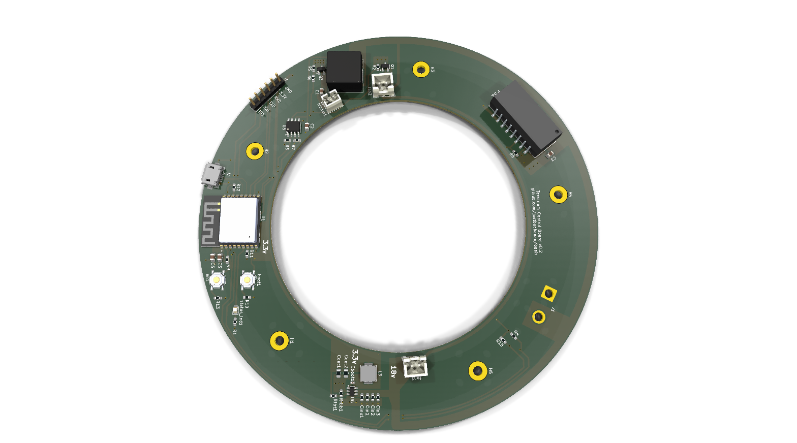
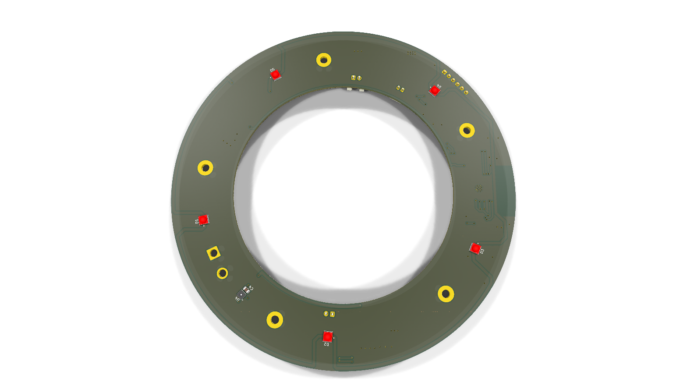
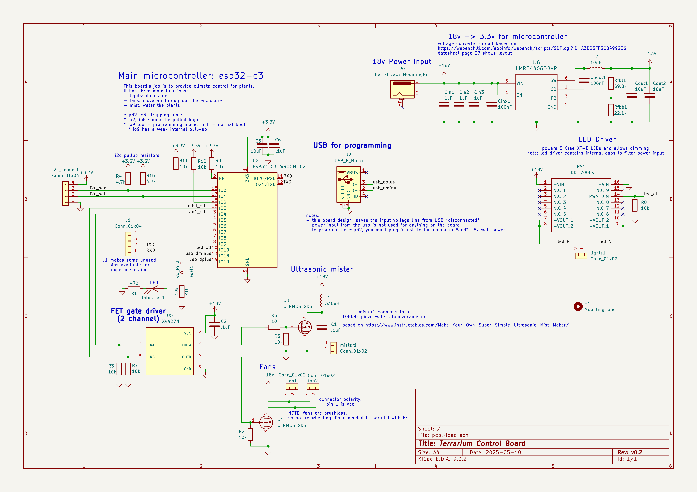
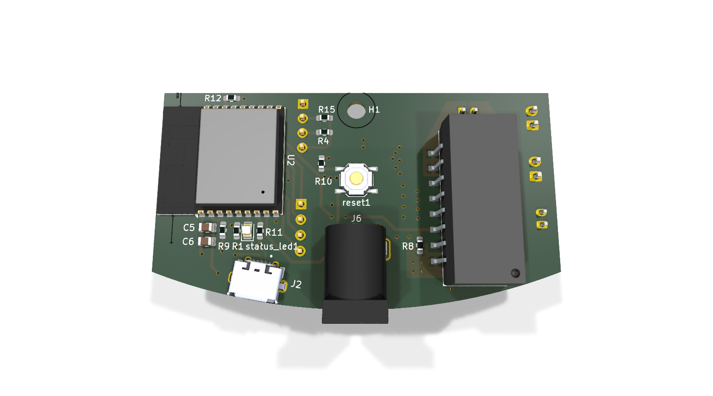
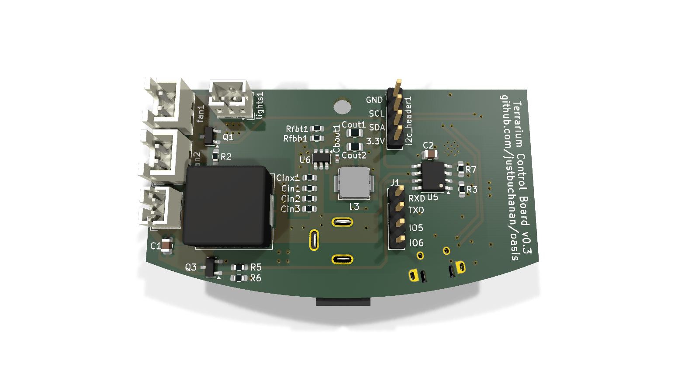
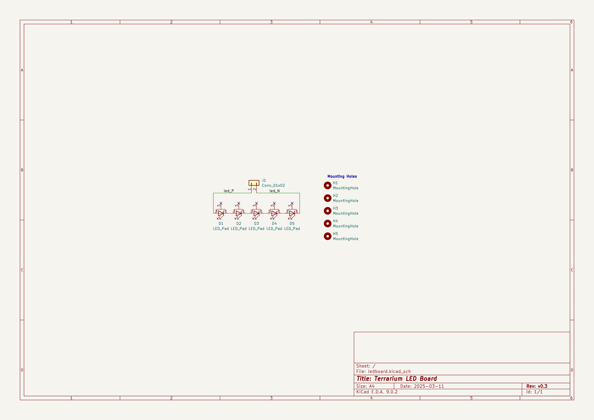
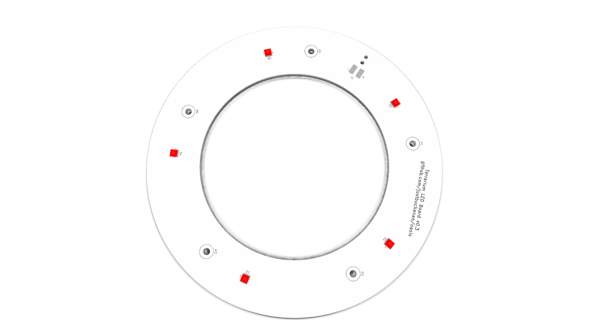
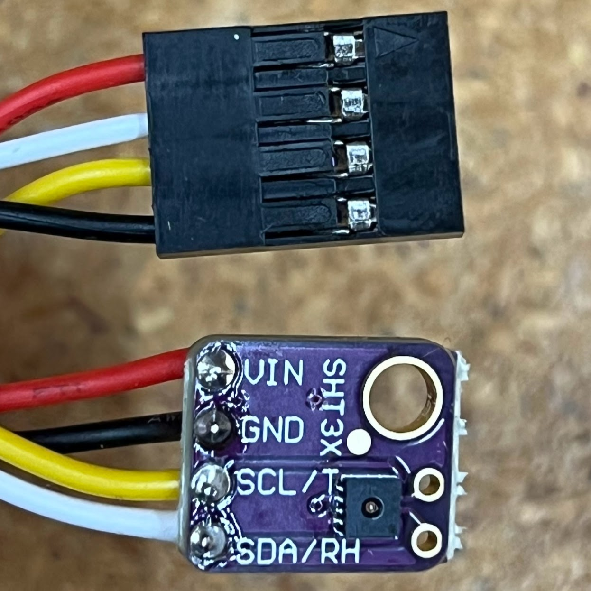

+++
title = 'Electronics'
weight = 4
+++

# Electronics

## How to get them?

There are essentially three options for obtaining the electronics:

- Order bare PCBs (from OSH Park, JLCPCB, PCBWay) and parts (digikey, mouser, etc) and solder them yourself. This can be a good option if you have experience with SMD soldering.
- Order fully-assembled PCBs from JLCPCB. This can be a good option if you'd prefer not to solder the boards yourself, but it can be expensive for small order quantities.
- [Sign up to buy a kit](/docs/contact/#buying-a-kit) if/when they become available. I don't have any immediate or concrete plans to sell these, but will consider it if there's enough interest.

## Design

### Overview

The electronics have a few main tasks:

- power the lights and allow for brightness control ("dimming")
- turn the fans on/off
- drive the mister (this is a somewhat complicated resonant circuit)
- communicate with the temperature+humidity sensor
- wifi
- usb port for programming/debugging

### Microcontroller

Requirements:

- i2c for sensors ([sht30](https://www.digikey.com/en/products/detail/sensirion-ag/SHT30-DIS-B2-5KS/5872250))
- 1 pwm for LED driver
- 1 pwm for mist
- 1 gpio for fans
- wifi

While there are a quite a few microcontrollers that fit the requirements, they vary widely in size and cost. I selected the esp32 due its small size (smaller than a postage stamp), SMD footprint (can be soldered directly to a board), and low cost (~$3).

### LEDs + Driver

I chose [Cree XT-E LEDs](https://downloads.cree-led.com/files/ds/x/XLamp-XTE.pdf) as these are common in the aquarium and terrarium hobbies for building high power lighting and because I have prior experience with them.

A string of LEDs is best powered by a constant-current driver. There are a lot of options here, but I selected the [Meanwell LDD-700LS](https://www.digikey.com/en/products/detail/mean-well-usa-inc/LDD-700LS/7704762) due to its small SMD footprint, dimming control via pwm, and ease of use (no external components required). This driver can provide up to 700mA (hence the 700 in the name), but there are several variants that can provide more or less current.

I chose to go with five LEDs laid out in a circle at the top of the terrarium. The circular spacing gives a more even lighting to the enclosure than we'd get with one LED in the center or several bunched closely together. The choice of five LEDs was somewhat arbitrary.

Cree XT-E LEDs have a forward voltage a little under 3V when current is 700mA (see page 21 of the [datasheet](https://downloads.cree-led.com/files/ds/x/XLamp-XTE.pdf)). With five LEDs in series, this means we need a total voltage of ~15V across the LEDs. The driver input voltage must be around 2v higher than its output voltage, giving us a minimum of ~17v to power the driver.

### Mister

I'm using an ultrasonic mister to provide watering in the terrarium. These are small discs made of a metal+piezo material sandwich with very tiny (~4uM) holes in the center. By applying an alternating voltage across the terminals of the disc, we can cause it to vibrate and "chop up" water into tiny particles that descend into the enclosure. The closer we can drive the disc to its natural resonant frequency (commonly ~110kHz), the faster and more efficiently we can drive it.

I heavily relied on these articles when designing the resonant circuit for driving the mister:

- https://www.edn.com/ultrasonic-mist-maker/.
- https://www.instructables.com/Make-Your-Own-Super-Simple-Ultrasonic-Mist-Maker/

Essentially a mosfet is switched on and off very quickly (~110kHz) causing it to alternate between "charging up" an inductor and dumping that charge across the misting disc. The mosfet is connected to a mosfet gate driver, which receives the 110kHz signal from a pwm output on the microcontroller.

Some mist driver circuits use a dedicated square wave generating IC like a 555 timer to provide the 110kHz signal, however this design uses a pwm output from the microcontroller. This has a couple advantages:

- less components
- the signal frequency can be changed in software to accommodate different misting discs

And one key disadvantage: it is possible to write firmware that outputs an "always on" signal rather than the expected 110kHz square wave, which will cause the misting circuit to let out the magic smoke.

### Voltage Requirements

- LED driver: >17v
- sensors: 2.2v - 5.5v
- esp32: 3.3v
- fans: nominally 24v, but can run at 18v
- mist: >12v

I chose to use an input voltage supply of 18v in order to satisfy the requirements of the higher-voltage devices, then include a voltage regulator to provide 3.3v for the lower-voltage devices. I selected a buck converter from TI and used their WeBench tool to design a regulator circuit. See details [here](https://github.com/justbuchanan/oasis/blob/main/pcb/reference/voltage-circuit-export-from-ti-webench.pdf).

## Thermal Considerations

It turns out that LEDs, even fairly efficient ones like we're using here, produce a lot of heat.

The initial design of the electronics placed all components, including the LEDs and the temperature+humidity sensor on one board. I anticipated that this might have issues with overheating, but the elegance of having everything on one board was too hard to resist, so I stubbornly pushed forward. Below are renders of the initial design:

<!-- Show the front and back renders side-by-side -->

  

    
    
Top View

  

  

    
    
Bottom View

  

Predictably, the LEDs quickly caused the board to heat up, throwing off the temperature sensor readings and bringing the esp32 close to its operating limits. I attempted to mitigate the overheating by drilling lots of ventilation holes in the 3d-printed top of the enclosure and sticking a dozen small heat sinks to the top of the circuit board. This helped a bit, but not enough. The only way to make this work would be to significantly limit the max LED brightness in firmware, leaving the lighting levels significantly below what I had hoped for the terrarium.

Back to the drawing board! The final design opts to place the LEDs on their own board made out of aluminum to act as a heat sink. Almost everything else is placed on a separate mainboard. The temperature+humidity sensor is on its own board that sits inside the enclosure, thermally isolating it from the heat of the LEDs.

## Mainboard

The mainboard contains:

- a microcontroller with builtin wifi ([esp32-c3](https://www.espressif.com/en/products/socs/esp32-c3))
- led driver
- 18v to 3.3v voltage converter
- ultrasonic mister driver
- fan driver
- usb connector for updating firmware

Find the KiCad design files here: https://github.com/justbuchanan/oasis/tree/main/pcb/main.

### Schematic

### 3D Renders

<!-- Show the front and back renders side-by-side -->

  

    
    
Top View

  

  

    
    
Bottom View

  

## Ledboard

The LED board is very simple - it's 5 LEDs wired in series mounted on an aluminum board to act as a heatsink.

Find the KiCad design files here: https://github.com/justbuchanan/oasis/tree/main/pcb/ledboard.

In order to connect to the mainboard, the ledboard needs a 2-pin JST PH connector (for example https://www.amazon.com/dp/B01DUC1O68) soldered onto it.

### Schematic

### 3D Render

## SHT30 Sensor Board Wiring

The sht30 sensor board comes without a cable. You'll need to solder a standard 4-pin connector cable in order to plug it into the mainboard.

## PCB Order History

### v0.1 all-in-one board - Feb 11, 2025

Single-board design - esp32, leds, sht30 temp/humid sensor, and everything else all on one board.

A lot of the board was assembled by JLC, but the following parts were purchased and assembled separately (in total, probably $17 worth of parts per board):

- led driver
- leds
- sht30 temp/humid sensor
- sht30 bypass capacitor

Files: https://github.com/justbuchanan/oasis/tree/main/pcb/fabricated-boards/v0.2

#### Pricing

note: this price info is what I was charged by JLC, it does not include the components I sourced and assembled myself (mentioned above).

- total: $140
    - merchandise total: $89
    - shipping: $38
    - sales tax: $13

### v0.2 ledboard - March 16, 2025

Based on the poor thermal performance of the all-in-one boards, I decided to do a major redesign and put the leds on their own board, made out of solid aluminum. The electronics are on their own board.

This order is for 5x 1.6mm thick boards for the leds. Price/board = $6.84. This price doesn't include the 5 Cree XT-E LEDs or the connector cable soldered on.

Files: https://github.com/justbuchanan/oasis/tree/main/pcb/fabricated-boards/ledboard-v0.3

#### Pricing

- total: $35
    - merchandise total: $14
    - shipping: $18
    - sales tax: $3

### v0.2 mainboard - March 21, 2025

Files: https://github.com/justbuchanan/oasis/tree/main/pcb/fabricated-boards/mainboard-v0.3

5 Control boards. Fully assembled except the 2 4-pin headers. Price/board = $40.6.

- total: $203
    - merchandise total: $153
    - shipping: $29
    - sales tax: $21

## Power Consumption

Power consumption of the electronics was measured using a bench power supply set to 18V. Here are the results:

| Configuration                                                   | Current Draw (amps) |
| --------------------------------------------------------------- | ------------------- |
| Microcontroller plugged in, everything (mist, fans, lights) off | 0.01-0.03           |
| LEDs 100% on                                                    | 0.61                |
| Fans on                                                         | 0.09                |
| Mister on, water present                                        | 0.05                |
| Mister on, no water present                                     | 0.03                |
| Everything on (mister, fans, LEDs @ 100%), water present        | 0.72                |
