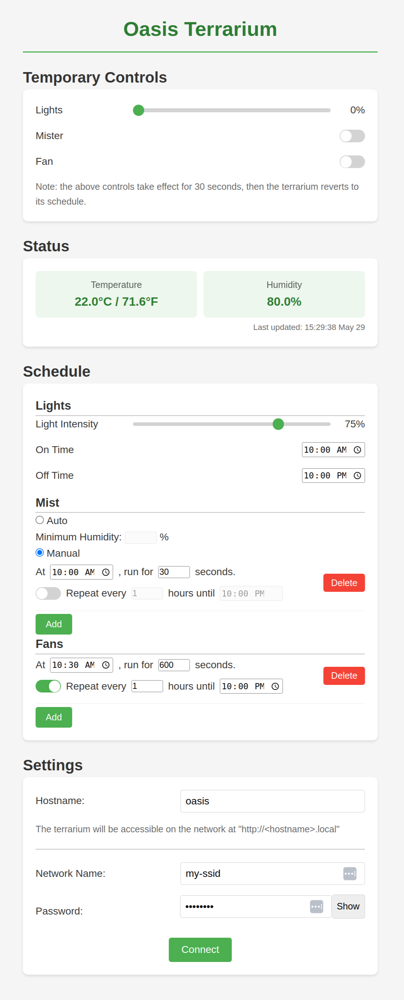

+++
title = 'Usage Guide'
weight = 3
+++

# Usage Guide

You're terrarium's all assembled, what's next?

## A Note on WiFi / Internet Access

The terrarium is designed to connect to your home wifi network for two reasons.

The most obvious is so that it can be configured, controlled, and monitored from your phone or computer.

The less obvious reason is that the terrarium has no way of knowing what time it is when it first turns on. In order to determine the current time, it asks the internet (see [ntp on wikipedia](https://en.wikipedia.org/wiki/Network_Time_Protocol)). This is the only communication the terrarium does with the internet. If you're familiar with software, you're welcome to review the [code](https://github.com/justbuchanan/oasis/tree/main/code) and verify for yourself :)

> [!NOTE]+ Note
> It would be possible to change the software so that you can manually tell the terrarium what time it is, making it unnecessary for it to connect to the internet. The downside is that you would have to do this every time you unplug it or there's a power outage.

> [!NOTE]+ Note
> It would be possible to add a battery and a time-keeping circuit to the control board so that once configured, the terrarium wouldn't need to use the internet to determine the current time. The downside is that this would increase the cost and complexity of the device. Because WiFi connectivity is already required to control the terrarium from your phone/computer, this probably isn't worth it.

## Firmware Installation / Updates

Before you can begin using the terrarium, you'll need to install the firmware on the mainboard. See the [readme](https://github.com/justbuchanan/oasis/tree/main/code#run-oasis-program) for more info.

## Initial Setup

After plugging in the power supply, Oasis will start up and begin broadcasting its own wifi network named something like `oasis-1234` (with a random 4-digit number). Connect to this network, then open your web browser and navigate to `http://oasis.local` to connect to the terrarium.

In the "Settings" section at the bottom, you can enter the name and password for your wifi network and optionally change the "hostname" of the terrarium. The default hostname makes the terrarium accessible at "http://oasis.local", but you can change it to whatever (valid) name you'd like. Once you've entered the wifi information, click the "submit" button. This will cause the terrarium to restart and attempt to connect to your wifi network.

You can now connect your phone/computer back to your main wifi network and browse to the hostname of the terrarium (again the default is "http://oasis.local"). Assuming everything worked, you're all setup!

If the terrarium was unable to connect to the network, it will revert back to broadcasting its own network (something like "oasis-1234"), allowing you to re-enter the wifi password, etc, and try again.

## Web Interface

Here's a screenshot:

### Schedule

Oasis defaults to having the lights on at 70% power from 10am to 10pm, but you can adjust this however you'd like based on your selection of plants and personal preferences.

> [!NOTE]
> The LED lighting in this design is fairly powerful and it's likely that 100% power is too high for many plants. You may need to experiment to determine what the light intensity should be for your setup.

Like the lighting, the mister and fans can be scheduled to run throughout the day.

### Temporary Controls

In addition to the automated schedule, the lights, mister, and fans can be controlled on a temporary basis using the controls at the top of the web interface.

From past experience, I've learned that it's not a good idea to have a button that says "turn the mist on until I turn it off again" because at some point you will press the button and walk away and forget about it. When you return later, the water tank will be empty and your plants will be drenched. For this reason, the temporary controls all take effect for 30 seconds, before reverting back to the terrarium's configured schedule.

## Filling the Water Tank

To access the water tank, unscrew the plug on the top. Fill the tank until the water level is just a bit below the o-ring. I'd recommend using a funnel or a squirt bottle (something like [this](https://www.amazon.com/dp/B07DB1HCKP)) to fill the tank because otherwise it is very easy to spill water through the ventilation holes into the top piece of the terrarium. Perhaps having the ventilation holes so close to the water fillup port is a design flaw, but this is the current state of the design.

### Distilled or RO Water is Recommended

## Adjusting the Mister

too tight = reduced mist output
too loose = water leaking around the o-ring/mister

## Plants!

I'll refrain from including much information on design and planting here because there are a lot of good resources online that cover this in depth.

When it comes to plants, the main thing to keep in mind is that the terrarium is a high-humidity environment. Plants like succulents and cacti will not do well here. Plants like mosses, ferns, miniature orchids, and many others will do well.

Another consideration is size - select plants that won't quickly outgrow the limited space available.

By design, the side walls of the terrarium are easy to remove and put back again. This makes it easy to clean the walls and to get access to your plants for trimming, rearranging, etc. You may opt to build your terrarium in a way that the walls will stay fixed - maybe you want to lean sticks, rocks, dirt, etc against the walls to create a structured layout, and that's ok! Just be aware that you may be unable to remove the walls later. If you go this route, consider glueing the walls into the bottom piece for added strength.

## Hard Reset

The terrarium includes a hard reset button at the top that can be pressed using a standard paperclip. You should never actually have to use this - it's there as a failsafe in case there's an issue with the software and you want to reset the configuration to "factory default".

If you're having issues with connecting to the terrarium, first try rebooting it. There is no reboot button - just unplug the power cable, then plug it back in.

If you do need to use the hard reset, press the button down for ~5 seconds. The terrarium will start flashing its lights slowly for those 5 seconds, then flash them quickly to let you know the reset was registered. It will then delete its configuration (wifi information, schedule, etc) and reboot. Once it restarts, you can follow the [Initial Setup](#initial-setup) instructions to reconfigure it.
